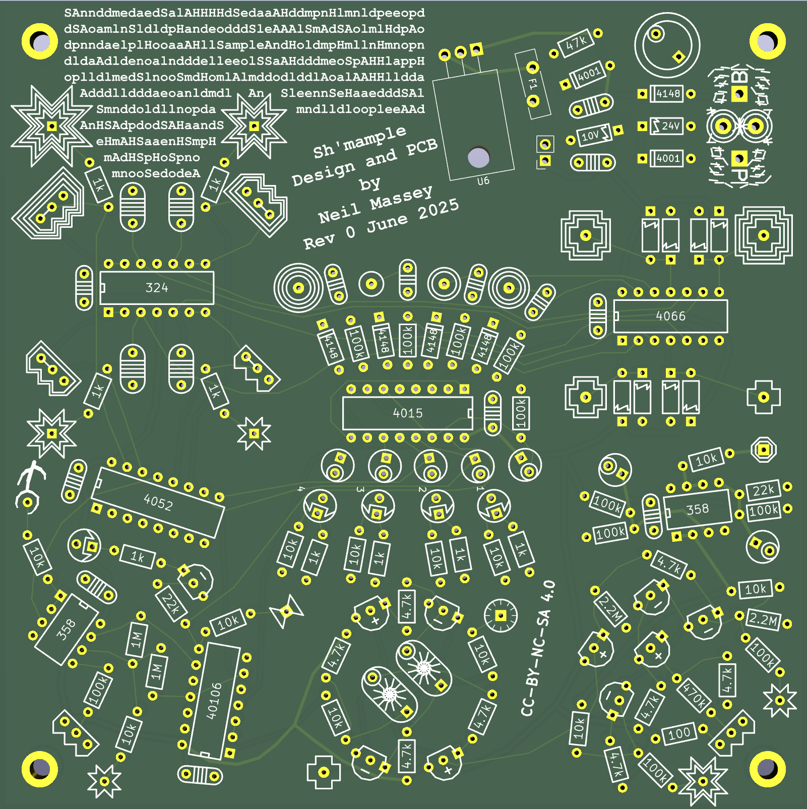

Sh'mample
=========

Sh'mample is a shift register driven sample and hold sequencer, capable of rungling.
Inspired in equal parts by the Ciat-Lonbarde Man with the Red Steam, and the Buchla 264.

For use with Ciat-Lonbarde instruments.

[Guide](assets/guide.md)

