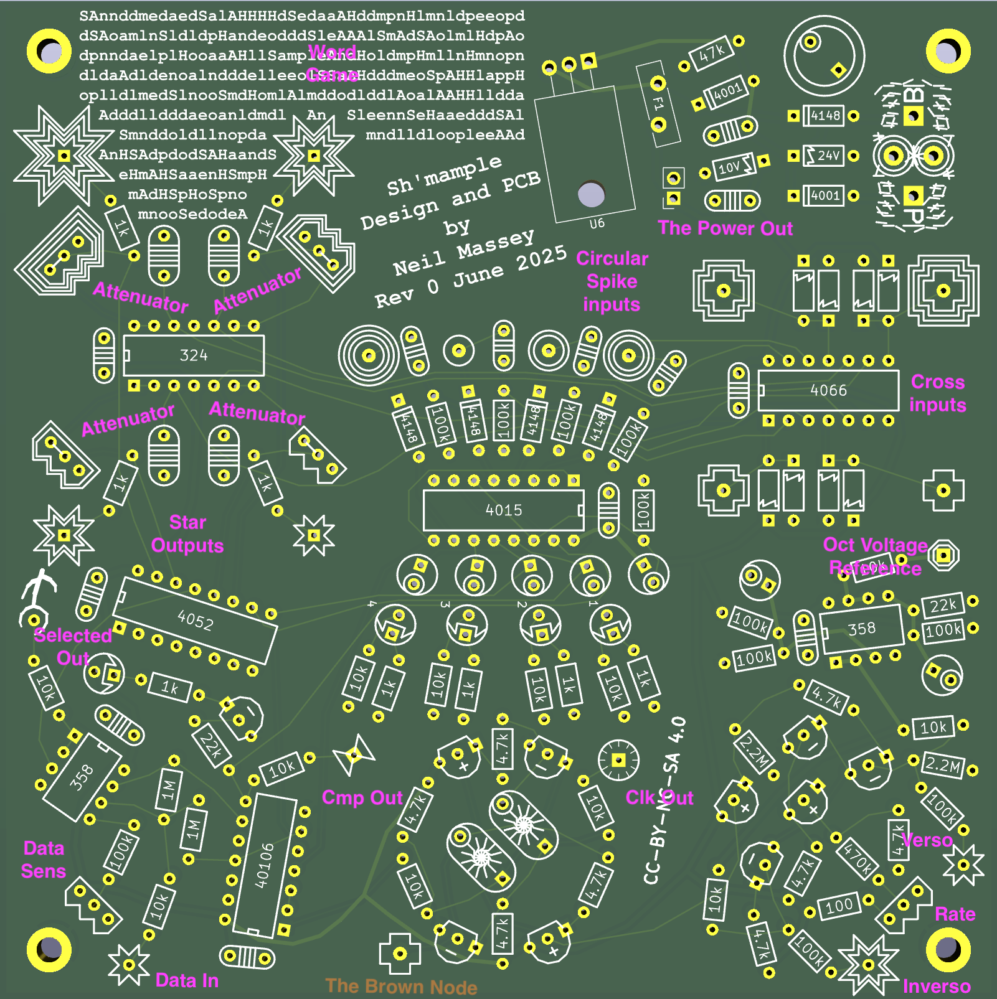

Sh'mample Guide
===============

Sh'mample consists of several circuit blocks, interacting:

1.  A clock, with rate nob control, plus verso and inverso inputs.  The special brown node is indicated on the circuit board.  Whether to connect it up is left as user choice.
2.  A comparator, deciding the input for the shift-register, comparing the Data In node with the Data Sense nob.  If nothing is connected here, the 2nd output from the shift register is taken as default input to the Data In node.
3.  A shift-register, driven by the clock.  If the default data input is taken, then the sample-and-hold will advance one stage at a time, tick-tock tick-tock.
4.  A four stage sample and hold, driven by the shift-register.  The Square Inputs provide the signals.  If the default data input is taken, then each stage will be sampled in turn, changing its output every 4th clock tick.  The attenuators can reduce the output sampled voltage.
5.  A single stage Selected Out.  If the default data input is taken, then each stage will be output here one after the other, just after it is sampled.  If an output is attenuated then it will also be attenuated when selected.
6.  Buffered outputs for each sample and hold at the Star Outputs.

Voltage references are provided so that stage 5 can act as a sequencer, outputting a different voltage each clock tick.  The attenuators on the outputs, in conjuction with the voltage reference, allows quite a conventional 4 stage sequencer to be patched.

The real fun happens when you plug something into the data input, where it acts something like a Klee sequencer, but sampling and holding between 1 and 4 sources per clock tick, and changing the selected output based on the contents of the shift-register.

The Circular Spike Inputs can be used to override the shift-register at each sample-and-hold.  Send a signal here to force that stage to sample-and-hold from the Square Input and present the signal at the Star Outputs.

The Power Out can be used to power another board.  Such as the Fourses Tarp, for which this circuit was designed for.

